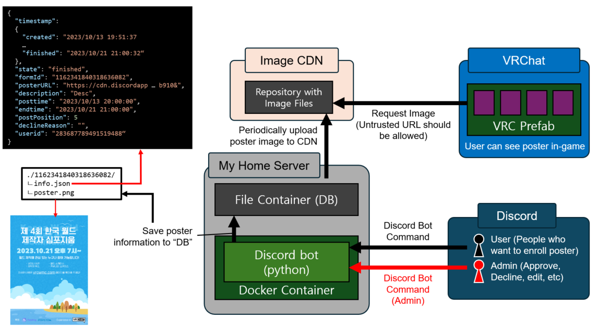

# VRCPosterSystemBot

This repository holds Discord bot to handle user poster enroll.

이 레포지토리는 유저의 포스터 등록을 처리하기 위한 봇의 정보를 담고 있습니다.

# Preset

- [Install Docker](https://docs.docker.com/get-started/)
- Create `./db/archive`
- Create `./db/online`
- Create `.env` with content of
```
DISCORD_TOKEN=[DISCORD BOT TOKEN]
DISCORD_GUILD=[SERVER ID TO USE]
```
This repository doesn't have information about how to setup discord bot and get token. You'll need to find your way to use it.

If setup is properly done, `./run.sh` will do everything for you. You can `tmux attach -t vrcp` to connect window with executed bot. Please search manual around tmux.

Since this enroll system use discord's channel id to separate each enrollment, you many need to use other system as [ticket bot](https://tickettool.xyz/) to setup system.

한국어
- [Docker 설치](https://docs.docker.com/get-started/)
- `./db/archive` 폴더를 만들어 주세요.
- `./db/online` 폴더를 만들어 주세요.
- 아래 내용을 담은`.env` 파일을 만들어 주세요.
```
DISCORD_TOKEN=[DISCORD BOT TOKEN]
DISCORD_GUILD=[SERVER ID TO USE]
```
이 레포지토리는 디스코드 봇을 만들고 토큰을 생성하는 방법에 대해서는 다루지 않습니다. 그 부분은 직접 알아내야 합니다.

셋업이 끝났으면, `./run.sh`를 입력하는 것으로 모든 것이 작동할 것입니다. `tmux attach -t vrcp`로 작동중인 봇 스크린에 접근이 가능합니다. tmux의 사용법은 따로 검색해보셔야 합니다.

이 시스템은 디스코드 채널 ID를 각 포스터 등록 구분에 사용하기 때문에, [ticket bot](https://tickettool.xyz/)과 같은 다른 봇을 사용해 각 유저를 채널별로 분리할 필요가 있습니다.

# Process

1. User enrolls poster with `/posterenroll`
2. Bot asks the several information around poster
3. After enroll is done, a user with manager can approve or deline
4. Every approved poster will make a copy to `./db/online`
5. You'll have to distribute those image using some kind of CDN.
6. For this system, there is `ImageTextureDownloader` on VRCSDK, which makes user can download image from web.

한국어
1. 유저가 디스코드를 명령 `/포스터신청`을 통해 신청을 합니다.
2. 봇이 여러 포스터 정보를 물어봅니다.
3. 등록이 끝나면, 관리자 유저가 이를 승인할지, 거절할지 결정할 수 있습니다.
4. 모든 승인된 포스터는 `./db/online`에 올라갑니다.
5. CDN 등을 사용해서 해당 이미지를 배포합니다.
6. 본 레포지토리의 경우, VRCSDK에서 `ImageTextureDownloader`를 사용해 웹에서 이미지를 다운로드 할 수 있어서, 게임에서 이미지를 확인할 수 있습니다.
